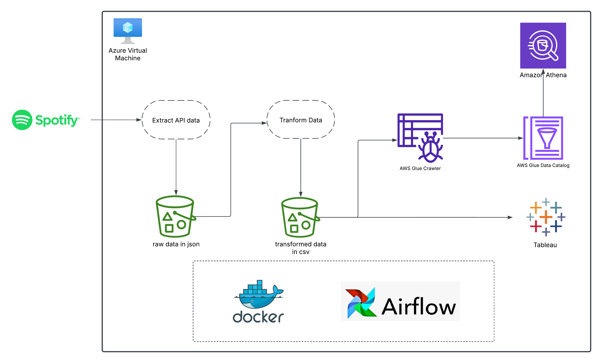
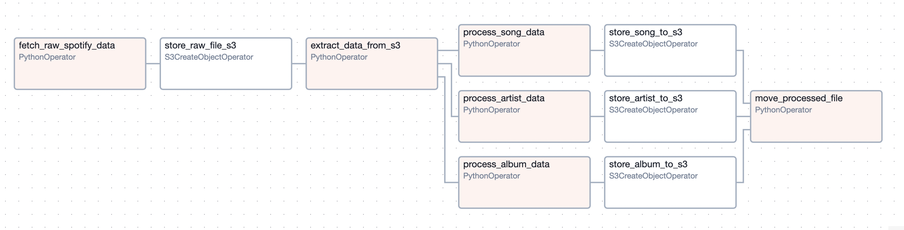

# 🎵 Spotify Data Pipeline Orchestration & Automation using Airflow and Docker  

## 📌 Project Overview  
This project builds upon previous work with Spotify data but introduces **Apache Airflow** to **orchestrate and automate** the entire ETL pipeline. The infrastructure for Airflow is set up using **Docker** on an **Azure Virtual Machine (VM)** to streamline workflow execution.

---

## 🏗️ Architecture Diagram  
Here’s the **high-level architecture** of the project:  
  

---

## ⚙️ Infrastructure Setup  

1. **Create a Virtual Machine on Azure**  
   - Ensure the VM has sufficient resources (recommended: 2 vCPU, 4GB RAM).  
   - Install **Docker** and **Docker Compose** on the VM.  

2. **Prepare Directories**  
   - Create necessary directories in the VM for **DAGs**, logs, and other Airflow-related files.  
   - Either **mount a local directory** to the VM’s `dags` directory or manually **copy DAG files** whenever updates are made.  

3. **Deploy Airflow using Docker Compose**  
   - Run the following command inside the VM where `docker-compose.yaml` is located:  
     ```sh
     docker-compose up -d
     ```
   - This pulls and starts all required Airflow services.  

4. **Expose Airflow Webserver**  
   - Airflow runs on **port 8080** by default.  
   - Add an **inbound rule** in the Azure VM's security settings to allow traffic on port `8080`.  
   - Access the Airflow UI using:  
     ```
     http://<VM_PUBLIC_IP>:8080
     ```

---

## 📡 Connecting to the Spotify API  
To pull data from Spotify, follow these steps:  

1. **Create a Spotify Developer Account**  
   - Register at [Spotify Developer Dashboard](https://developer.spotify.com/dashboard)  
   - Generate **Client ID** and **Client Secret** for API access.  

2. **Extract Data**  
   - For this project, we extract **Pawan Kalyan’s Top 100 Songs** playlist:  
     - 🔗 [Spotify Playlist](https://open.spotify.com/playlist/7FEuqXANtDkiehhypFPSI3)  
   - The data is fetched in **JSON format**.  
   - To fetch **Top 50 Indian Songs**, use the API credentials and modify the request accordingly.  

---

## 📂 S3 Data Storage Structure  
We use **AWS S3** to store both raw and processed data. The following structure is maintained inside an S3 bucket named **`spotify-airflow-pipeline`**:  


- **raw_data/to_process/** → Stores unprocessed Spotify API JSON responses.  
- **raw_data/processed_file/** → Holds raw data files after initial processing.  
- **transformed/** → Segregated and cleaned data stored in CSV format.  
- **athena_queries/** → Stores query results from AWS Athena.  

---

## 📊 DAG Workflow in Airflow  
The ETL pipeline follows a **Fan-In & Fan-Out** model to maximize efficiency:  

1. **Extract data from Spotify API**  
2. **Store raw JSON data in S3 (`raw_data/to_process/`)**  
3. **Clean and preprocess data**  
4. **Segregate and store data in respective S3 directories (`albums`, `artists`, `songs`)**  
5. **Parallel processing of albums, artists, and songs** using **Fan-In & Fan-Out** technique  
6. **Crawl data with AWS Glue**  
7. **Query data using AWS Athena**  
8. **Analyze processed data in Tableau**  

🚀 **DAG Workflow Visualization:**  
  

Check the **`spotify_etl_dag.py`** file for the DAG implementation.

---

## 🗄️ AWS Glue & Athena Integration  

1. **Create AWS Glue Crawlers**  
   - Set up three crawlers for **albums, artists, and songs**.  
   - Assign them to an existing **database** or create a new one.  

2. **Run Crawlers & Verify Data**  
   - Ensure column mappings are correct (Glue sometimes misinterprets schema).  
   - Skip the **first row** during schema mapping if it contains an index.  

3. **Query Data in Athena**  
   - Verify if data is correctly populated in Athena tables.  
   - Perform SQL queries for further analysis.  

---

## 📈 Data Visualization in Tableau  
- The processed CSV files from S3 are **imported into Tableau** for visualization and analysis.  
- Insights such as **song trends, artist popularity, and album performance** can be derived.  


